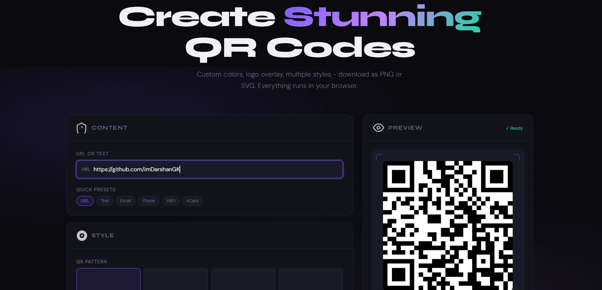

# ⬛ QR Studio

<div align="center">

**Beautiful, customizable QR code generator - zero backend, single HTML file.**

[](LICENSE)
[](CONTRIBUTING.md)
[](#)
[](https://app.netlify.com/start)

[**→ Live Demo**](https://qrbeam.netlify.app) · [Report Bug](../../issues) · [Request Feature](../../issues)



</div>

---

## ✨ Features

- **6 content types** - URL, plain text, WiFi, vCard, Email, Phone number
- **4 QR patterns** - Square, Rounded, Dots, Classy
- **Custom colors** - pick any foreground + background color with 8 quick presets
- **Logo overlay** - drag & drop your logo, resize it with a slider
- **PNG export** - high-res up to 1024×1024px
- **SVG export** - vector, infinitely scalable
- **Copy to clipboard** - paste directly into Figma, Notion, docs
- **Live preview** - auto-generates as you type
- **Error correction** - L / M / Q / H levels
- **Quiet zone control** - adjust margin size
- **Zero backend** - runs 100% in the browser. Nothing is sent to any server.
- **Zero dependencies** - one CDN script for QR encoding, everything else is vanilla HTML/CSS/JS
- **Zero build step** - open `index.html` and it works

---

## 🚀 Quick Start

### Option A - Just open it
```bash
git clone https://github.com/imDarshanGK/qr-studio.git
cd qr-studio
open index.html
# or: python3 -m http.server 8080
```

### Option B - Deploy to Netlify (1 click)
[](https://app.netlify.com/start/deploy?repository=https://github.com/imDarshanGK/qr-studio)


---

## 📁 Project Structure

```
qr-studio/
├── index.html      ← the entire app (HTML + CSS + JS)
├── icons/
│   └── og-image.jpg ← social preview image
├── netlify.toml    ← Netlify deploy config
├── LICENSE
└── README.md
```

That's it. No `node_modules`, no `package.json`, no build config.

---

## 🎨 Supported QR Content Types

| Type | Format | Example |
|------|--------|---------|
| URL | Any valid URL | `https://github.com` |
| Text | Plain string | `Hello, world!` |
| WiFi | `WIFI:T:WPA;S:SSID;P:pass;;` | Auto-built from form |
| vCard | vCard 3.0 standard | Auto-built from form |
| Email | `mailto:` URI | Auto-built from form |
| Phone | `tel:` URI | `tel:+1234567890` |

---

## 🛠 How It Works

1. **Input** - User types a URL / text or fills a structured form (WiFi, vCard, etc.)
2. **Encoding** - [qrcodejs](https://github.com/davidshimjs/qrcodejs) generates the QR matrix into a `<canvas>` element
3. **Pattern rendering** - Canvas pixel data is read back and redrawn using the selected pattern (dots, rounded, etc.) via the 2D Canvas API
4. **Logo overlay** - The logo image is positioned absolutely over the canvas at the center, scaled to the chosen percentage
5. **Export PNG** - An offscreen canvas renders the QR at full output resolution (up to 1024px), draws the logo on top, and triggers a download
6. **Export SVG** - Canvas pixels are read, mapped to SVG `<rect>` / `<circle>` elements, and the logo is embedded as a base64 `<image>` tag

---


---

## 🔒 Privacy & Security

- **No server.** There is no backend. Your QR content never leaves your device.
- **No analytics.** No tracking pixels, no event logging, no cookies.
- **No external network calls at runtime.** The only external resource is the `qrcodejs` library loaded once from `cdnjs.cloudflare.com` on page load.
- **No storage.** Nothing is written to `localStorage` or `sessionStorage`.

---

## 📄 License

Released under the **MIT License** - free to use, fork, self-host, and embed in your own projects. See [LICENSE](LICENSE).

---

## 🙏 Acknowledgements

- [qrcodejs](https://github.com/davidshimjs/qrcodejs) - QR code generation
- Inspired by the frustration of ugly, ad-filled, privacy-invasive QR generators

---

<div align="center">
  <strong>If this saved you time, please ⭐ star the repo!</strong><br/><br/>
  Made with ❤️ by <a href="https://github.com/imDarshanGK">Darshan</a>
</div>